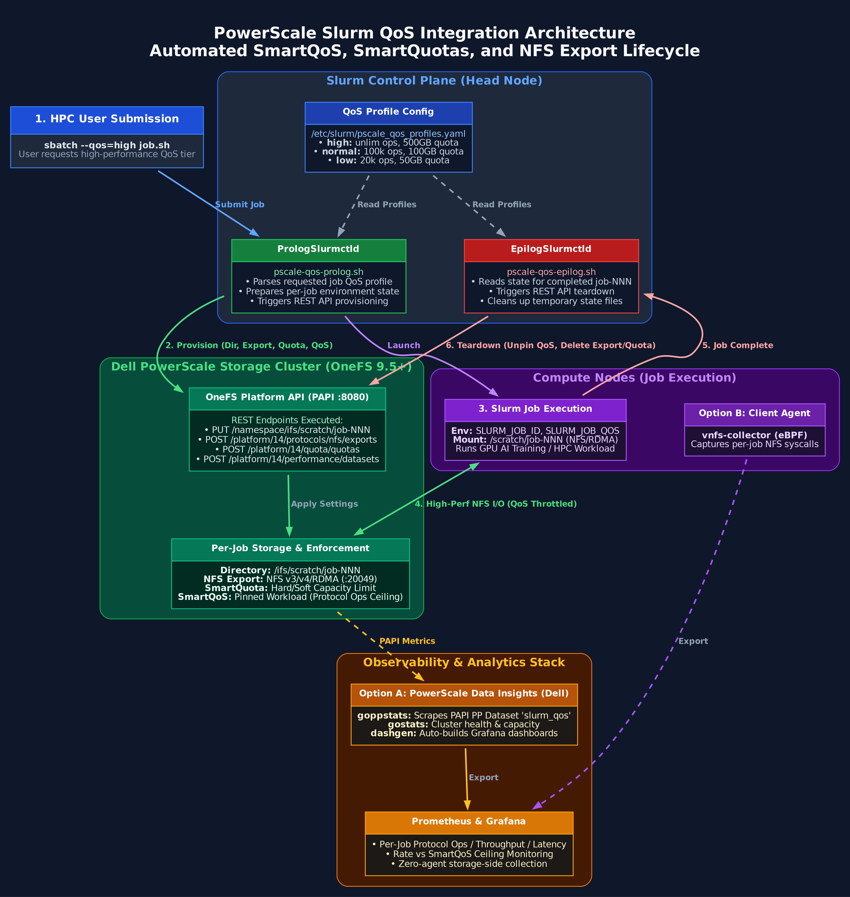
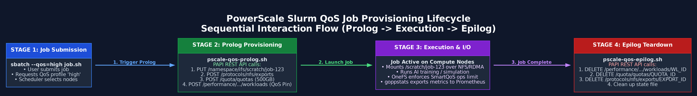

# PowerScale Slurm QoS Integration

**Status: Reference Implementation**

Dynamically apply Dell PowerScale SmartQoS storage limits to Slurm jobs. When a Slurm job starts, a lightweight prolog script maps the job to PowerScale QoS controls (protocol ops ceilings, bandwidth caps, quotas) via the PAPI REST API, and an epilog script tears them down when the job ends.

## What This Repo Contains

This is a **working reference implementation**, not a production-ready plugin. It includes:

| Folder | What's Inside |
|--------|---------------|
| [`config/`](config/) | QoS profile config (`pscale_qos_profiles.yaml`) |
| [`scripts/`](scripts/) | Prolog/epilog scripts (set `PSCALE_DRY_RUN=1` for dry-run mode) |
| [`docs/`](docs/) | Test guide, diagrams |
| [`tests/`](tests/) | End-to-end test scripts for live PowerScale (PAPI + CLI) |

## Architecture



The prototype uses Slurm's `PrologSlurmctld` / `EpilogSlurmctld` hooks (shell scripts that run on the head node at job start/end) to call the PowerScale REST API.

```
User: sbatch --qos=high train.sh
  |
  v
Slurm Head Node (PrologSlurmctld)
  1. Resolve job QoS via scontrol
  2. Look up limits from pscale_qos_profiles.yaml
  3. PAPI: create /ifs/scratch/job-<id> directory
  4. PAPI: create NFS export -> get export_id
  5. PAPI: create SmartQuota
  6. PAPI: pin SmartQoS workload (ops + bandwidth limits)
  7. Save state for epilog
  |
  v
Job runs (NFS I/O throttled by SmartQoS)
  |
  v
Slurm Head Node (EpilogSlurmctld)
  1. Unpin workload, delete quota, delete export
  2. Clean up state file
```



## SmartQoS Levers Available

The prototype currently maps jobs by **NFS export ID** (one export per job directory). SmartQoS datasets can partition workloads by several dimensions:

| Partitioning Metric | How It Would Work | Notes |
|---------------------|-------------------|-------|
| `export_id` | One NFS export per job, pin QoS by export | Current prototype approach |
| `path` | Pin QoS by filesystem path pattern | No per-job export needed |
| `username` | Per-user QoS regardless of job | Simpler but less granular |
| `remote_address` | Per-client-IP QoS | Useful for node-level throttling |
| `protocol` | Per-protocol (NFS3, NFS4, SMB, S3) | Coarse-grained |
| `zone_name` | Per-access-zone QoS | Multi-tenant isolation |

Up to 4 datasets with different partitioning can exist simultaneously (max 1024 workloads per dataset).

## Example QoS Profiles

The sample config includes these profiles (all values are adjustable):

| QoS | Protocol Ops/s | Bandwidth | Quota |
|-----|---------------|-----------|-------|
| `high` | Unlimited | Unlimited | 500 GB |
| `normal` | 100,000 | 5,000 MB/s | 100 GB |
| `interactive` | 50,000 | 2,000 MB/s | 20 GB |
| `low` | 20,000 | 1,000 MB/s | 50 GB |

## Quick Test (Docker, No PowerScale Needed)

Setting `PSCALE_DRY_RUN=1` lets you validate the full prolog/epilog lifecycle without a live cluster:

```bash
docker pull misterfitz/slurm:base-root
docker run -d --name slurm --hostname linux --privileged \
    -v $(pwd):/opt/pscale-qos \
    misterfitz/slurm:base-root \
    bash -c '/etc/startup.sh && tail -f /dev/null'
```

Then follow [docs/slurm-local-test-guide.md](docs/slurm-local-test-guide.md) to enable accounting, create QoS definitions, configure the prolog/epilog with `PSCALE_DRY_RUN=1`, and submit test jobs. The log output shows exactly what PAPI calls would be made for each QoS level.

## Validated

All PAPI operations (dataset create, workload pin with protocol_ops + bandwidth limits, unpin, quota create/delete, export create/delete) have been validated end-to-end on a PowerScale cluster running **OneFS 9.15.0.0**.

## Requirements

- **PowerScale:** OneFS 9.15+ for bandwidth limits, 9.5+ for protocol ops only
- **Slurm:** PrologSlurmctld/EpilogSlurmctld support + accounting enabled (slurmdbd)
- **Dependencies:** bash, curl, python3 with PyYAML

### OneFS Version Requirements

| Feature | Minimum OneFS |
|---------|---------------|
| SmartQoS (Protocol Ops limits) | 9.5 |
| SmartQoS (Bandwidth limits) | **9.15** |
| Partitioned Performance datasets | 8.0.1 |
| REST API (PAPI v14) | 9.4+ |
| SmartQuotas | Any |
| NFS exports via API | Any |

## Observability

[PowerScale Data Insights](https://github.com/Isilon/powerscale_data_insights) -- Dell's official Go-based collectors pull metrics directly from the cluster via PAPI. No software needed on compute nodes. Every pinned SmartQoS workload (= every Slurm job) automatically appears in Prometheus and Grafana.

| Binary | What It Collects | Port |
|--------|-----------------|------|
| **gostats** | Cluster-wide stats (CPU, network, protocol ops, disk I/O, capacity) | `:9437` |
| **goppstats** | Partitioned Performance per-workload data (per-path, per-protocol, per-user I/O) | `:9438` |
| **dashgen** | Auto-generates Grafana dashboards from PP dataset definitions | _(CLI tool)_ |

## Alternative Integration Approaches

The current prototype uses prolog/epilog shell scripts, but there are other Slurm integration points worth considering:

| Approach | What It Does | Best For |
|----------|-------------|----------|
| **`burst_buffer/lua`** | 7-stage lifecycle hooks, users request capacity with `#BB_LUA capacity=5TB`, TRES tracking | User-specified storage, stage-in/out, richer lifecycle |
| **`job_submit/lua`** | Reject jobs at submit time if user is over their SmartQuota | Quota enforcement before jobs queue |
| **Dell Omnia** | Ansible-based cluster deployment, automates NFS mounts + Slurm config | Greenfield deployments |

These can be combined -- e.g., `burst_buffer/lua` for per-job provisioning + `job_submit/lua` for quota guarding.

## References

- [PowerScale SmartQoS](https://infohub.delltechnologies.com/en-us/p/onefs-smartqos/)
- [PowerScale SmartQoS Architecture](https://infohub.delltechnologies.com/en-nz/p/onefs-smartqos-architecture-and-management/)
- [PowerScale Data Insights (gostats/goppstats)](https://github.com/Isilon/powerscale_data_insights)
- [Slurm QoS](https://slurm.schedmd.com/qos.html)
- [Slurm Prolog/Epilog](https://slurm.schedmd.com/prolog_epilog.html)
- [Slurm Burst Buffer](https://slurm.schedmd.com/burst_buffer.html)
- [Dell Omnia](https://github.com/dell/omnia)
